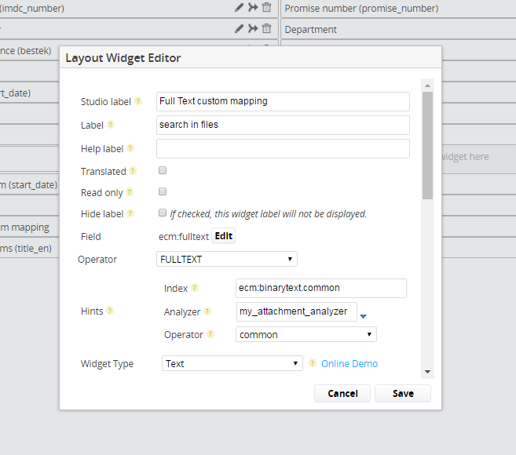

# Elasticsearch

In order to enable it, you need to overwrite the default page provider:

- Comment it out the __elasticsearch.override.pageproviders__ in your **nuxeo.conf** file
    ```
    elasticsearch.override.pageproviders=default_search,document_content,section_content,document_content,tree_children,default_document_suggestion,simple_search,advanced_search,nxql_search,DEFAULT_DOCUMENT_SUGGESTION
    ```


## Create a custom mapping

Check my template example: __my-custom-mapping__
It will allow you to search on files including "smart" search

> **note**: the result will depend on the Content view query. For example, in __projects__ content view It won't work because the query contains
> the "doc_type" constrain

Once it's created, you have to added it to your **nuxeo.conf** file: check __my-custom-mapping__ below
` nuxeo.templates=postgresql,drive,imdc-package,my-custom-mapping `

Adding your new mapping in Studio:



For more information, check nuxeo documentation:

[How Elasticsearch works in Nuxeo](https://doc.nuxeo.com/nxdoc/elasticsearch-indexing-logic/)

[Configuring-the-elasticsearch-mapping](https://doc.nuxeo.com/nxdoc/configuring-the-elasticsearch-mapping/)

[Elasticsearch Hints Cheat Sheet](https://doc.nuxeo.com/nxdoc/elasticsearch-hints-cheat-sheet/)


